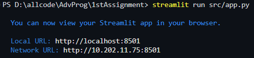
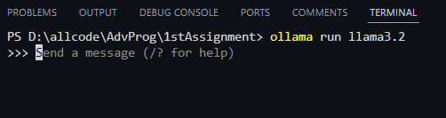
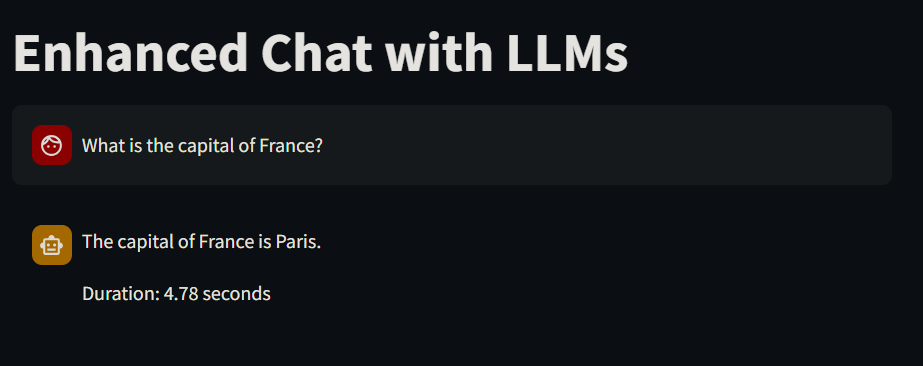
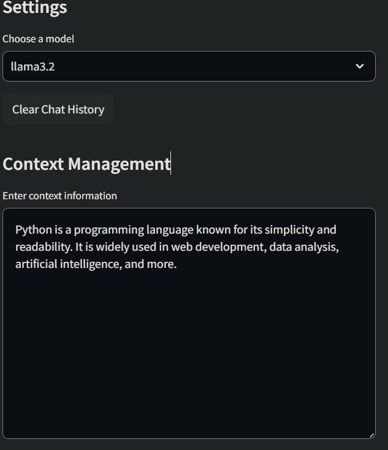
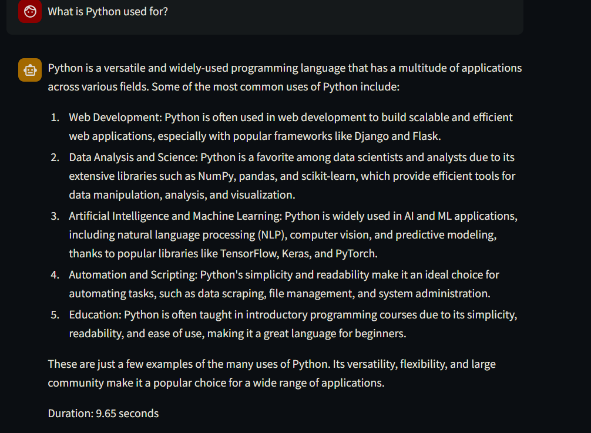
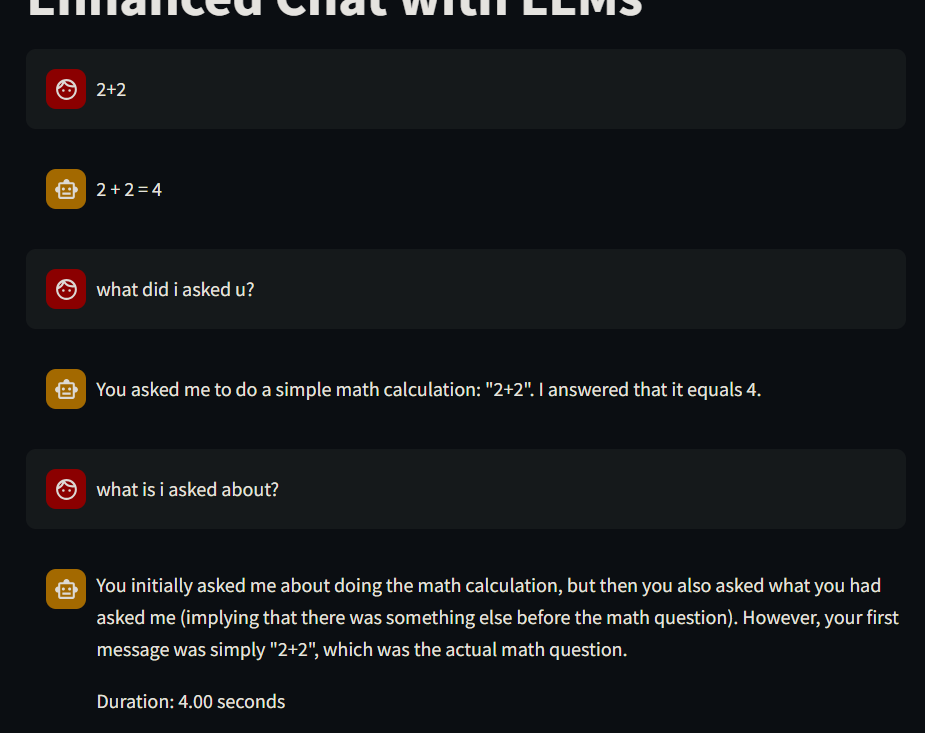

# Enhanced Chat with LLMs

## Overview

This project provides a web-based interface for enhanced interactions with Large Language Models (LLMs). It leverages the power of ChromaDB for persistent chat history and context management, and integrates Ollama for LLM embeddings and responses.

## Features

- Persistent chat history with session tracking.
- Context-aware question answering using ChromaDB.
- Ability to restore previous chat sessions.
- Interactive interface built with Streamlit.
- Flexible LLM selection and contextual processing.

---

## Installation

### Prerequisites

Ensure you have the following installed on your system:

- Python 3.8+
- pip (Python package installer)

### Steps

1. Clone this repository:

   ```bash
   git clone <repository-url>
   cd <repository-name>
   ```

2. Create a virtual environment and activate it:

   ```bash
   python -m venv env
   source env/bin/activate   # On Windows, use `env\Scripts\activate`
   ```

3. Install the required dependencies:

   ```bash
   pip install -r requirements.txt
   ```

4. Run the application:
   ```bash
   streamlit run src/app.py
   ollama run llama3.2
   ```
   
   

---

## Usage

### Start the Application

- After running `streamlit run app.py`, navigate to the URL displayed in your terminal (e.g., `http://localhost:8501`).

### Main Interface

1. **Chat Input:** Type your questions or prompts in the input box at the bottom.
2. **Context Management:** Paste any relevant context information in the sidebar and click "Process Context" to include it in your responses.
3. **Previous Conversations:** View and restore past sessions from the sidebar.
4. **Clear History:** Clear all chat history from the database via the sidebar option.

### Sidebar Options

- **Model Selection:** Choose from available models (e.g., `llama3.2`).
- **Start New Chat:** Begin a fresh chat session.
- **Clear All History:** Delete all stored conversations.

---

## Examples

### Example 1: Basic Question-Answering

1. Enter a question such as:

   > What is the capital of France?

2. Receive a response from the LLM:

   > The capital of France is Paris.

   

### Example 2: Context-Aware Question

1. Paste the following context in the "Context Management" section:

   > Python is a programming language known for its simplicity and readability. It is widely used in web development, data analysis, artificial intelligence, and more.
   > 

2. Enter a question:

   > What is Python used for?

3. Receive a contextually enhanced response:

   > Based on the provided context, Python is used for web development, data analysis, artificial intelligence, and more.

   

### Example 3: Restoring a Previous Session

1. Select a past session from the "Previous Conversations" section in the sidebar.
2. View and continue the restored conversation seamlessly.

---

## Data Storage

- **Chat History:** Stored persistently in the `chat_data/chat_history` directory.
- **Context Data:** Managed in the `chat_data/context` directory.
  

---

## Logging

The application logs activities and errors to the console for easy debugging and monitoring.

---

## Contributing

Feel free to fork this repository and submit pull requests. Ensure code quality and provide documentation for any new features.

---

## License

This project is licensed under the MIT License. See the LICENSE file for details.
